# 044 基于 Django 的中华民歌可视化平台-设计展示

> **代码有偿获取 可接受定制 微信联系方式: csbysj2020 或 ACE2487，备注(BS)**

> 

> 

## 视频

> **点击查看 \>\>\> [https://www.bilibili.com/video/BV1aNHSeuEbD/](https://www.bilibili.com/video/BV1aNHSeuEbD/)**

## 介绍

本项目是一款基于 Django 框架的中华民歌可视化平台，旨在为广大音乐爱好者提供一个全面、便捷的民歌数据查询、分析和展示的在线服务平台。以下是项目详细介绍：

一、项目背景

随着互联网的快速发展，音乐平台日益丰富，民歌作为一种独特的音乐形式，在我国具有广泛的影响力。然而，目前市场上缺乏针对民歌数据的整合与可视化展示。为此，我们开发了这款中华民歌可视化平台，以满足用户对民歌数据的需求。

二、技术栈

本项目采用以下技术栈：

- 后端：Python + Django
- 前端：Vue3 + VueRouter4 + Pinia + ElementPlus + Echarts + WindiCSS + Sass
- 数据库：Mysql
- 爬虫：Scrapy

三、功能亮点

1. 数据抓取：通过爬虫技术，自动抓取酷狗、网易云音乐等平台的音乐、歌手、专辑数据，确保数据实时更新。
2. 用户功能：支持用户注册、登录，打造个性化的民歌体验。
3. 可视化大屏：提供丰富的可视化图表，包括音乐平台数据量占比饼图、Top10 作者民歌数量漏斗图、各省份民歌数据分布地图等，直观展示民歌数据。
4. 数据分析：对比不同省份/直辖市的民歌风格特点，分析不同音乐平台的数据差异，为用户提供有价值的参考。
5. 数据展示：以多种形式展示歌曲、歌手、专辑信息，满足用户多样化的浏览需求。
6. 管理后台：实现对用户、歌曲、歌手、专辑等数据的增删改查，方便管理员进行平台维护。
   四、特色模块
7. 首页轮播图：展示热门民歌，让用户第一时间了解民歌动态。
8. 热门歌曲推荐：根据用户喜好，推荐个性化民歌。
9. 歌曲详情页：全面展示歌曲信息，提供相关歌曲推荐，增加用户粘性。
10. 歌手、专辑详情页：详细介绍歌手、专辑信息，提升用户体验。
11. 筛选表格：方便用户快速找到心仪的民歌。

## 截图

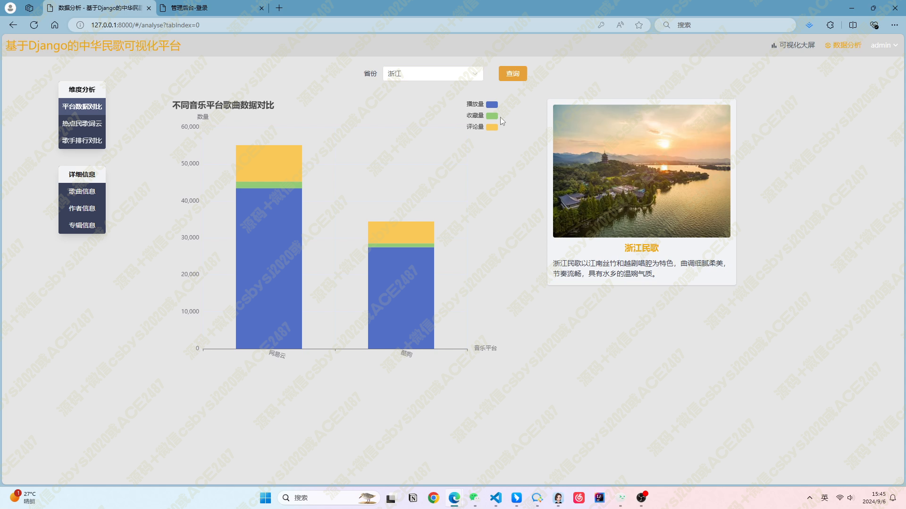
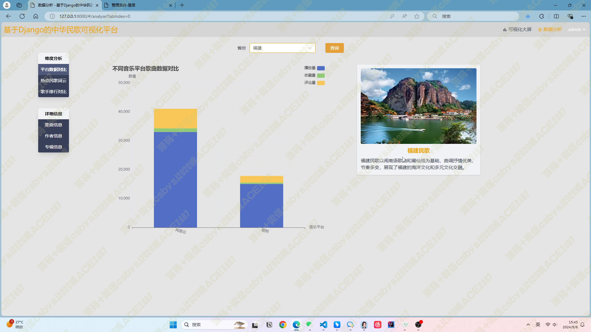
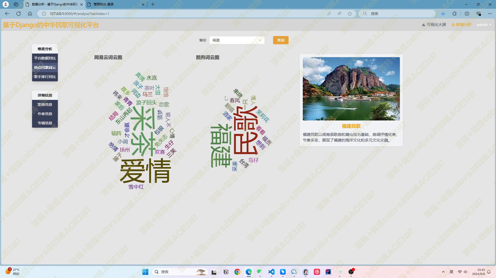
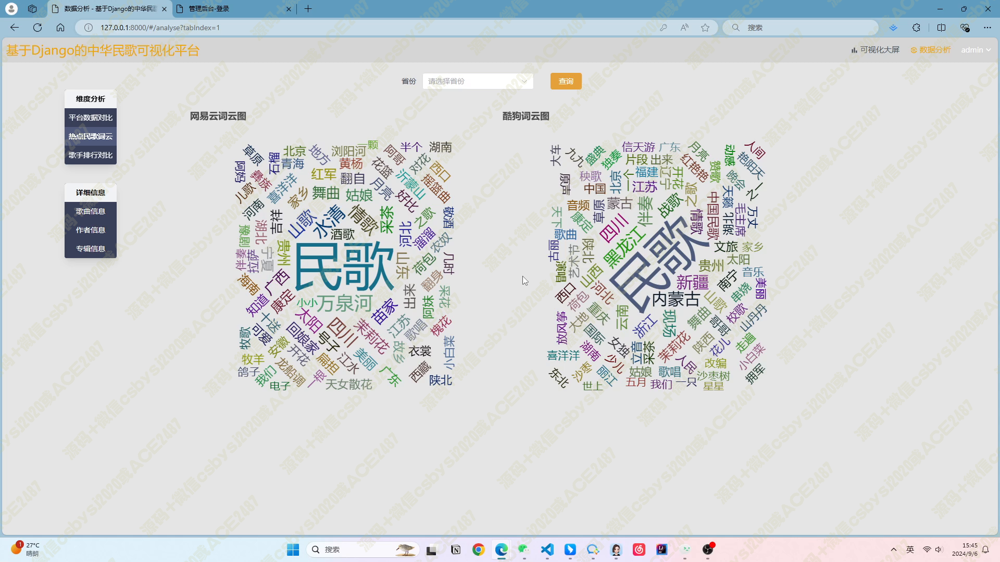
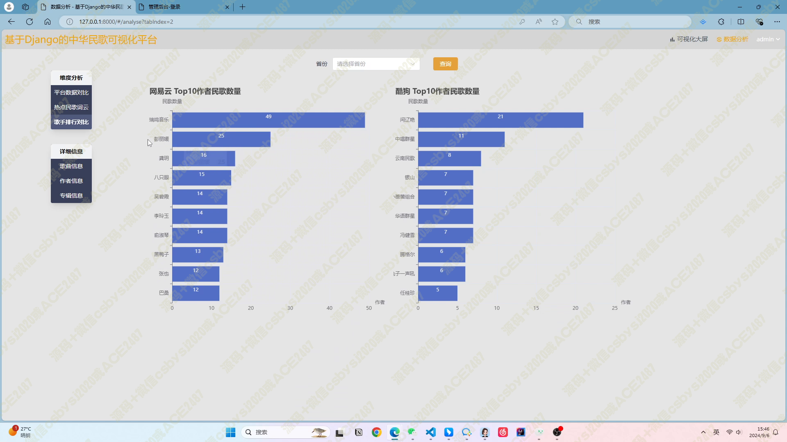
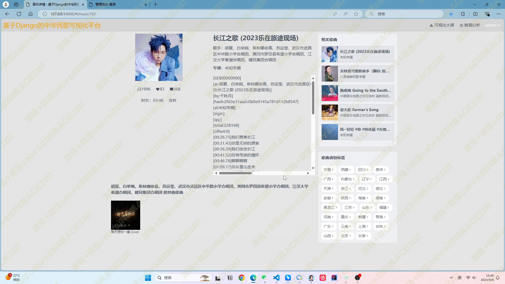
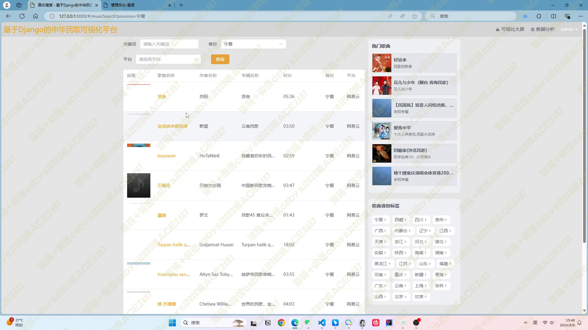
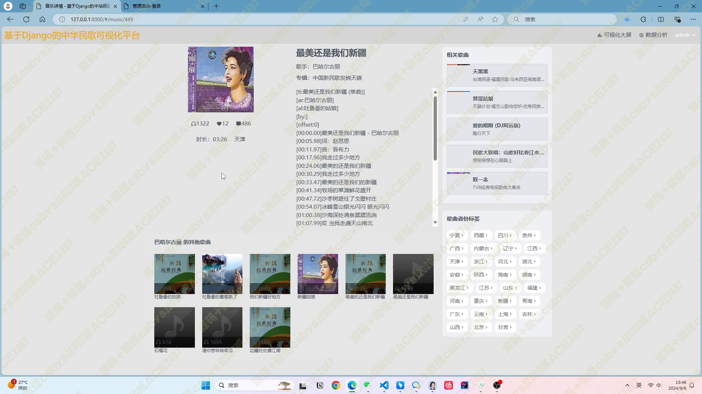
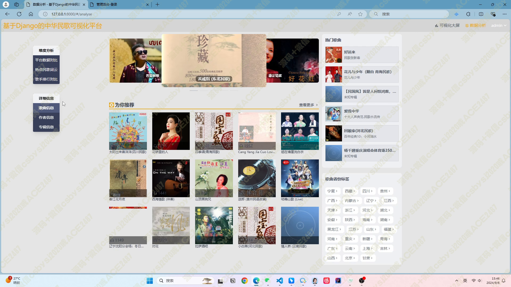
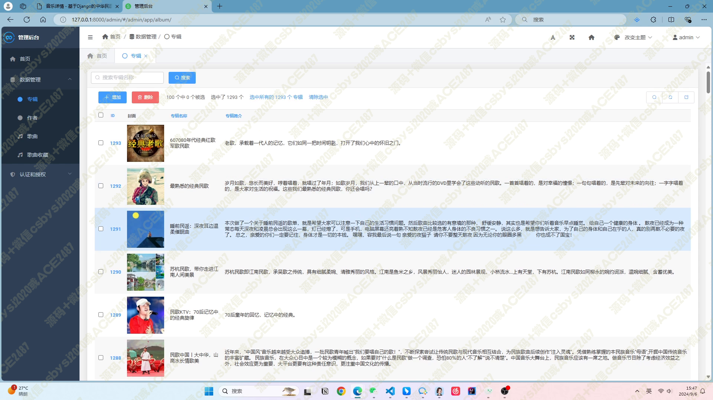
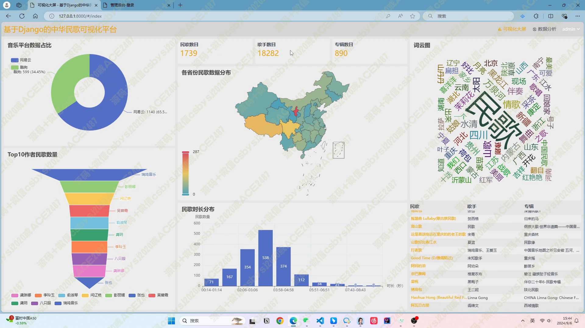
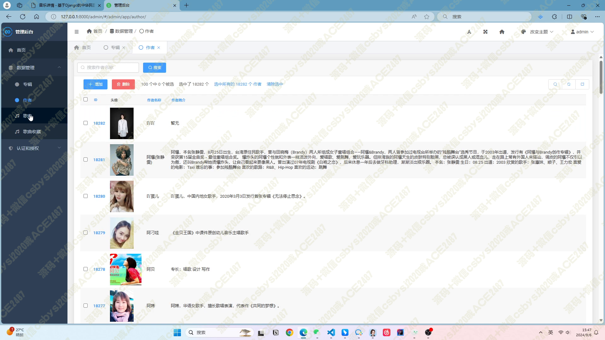
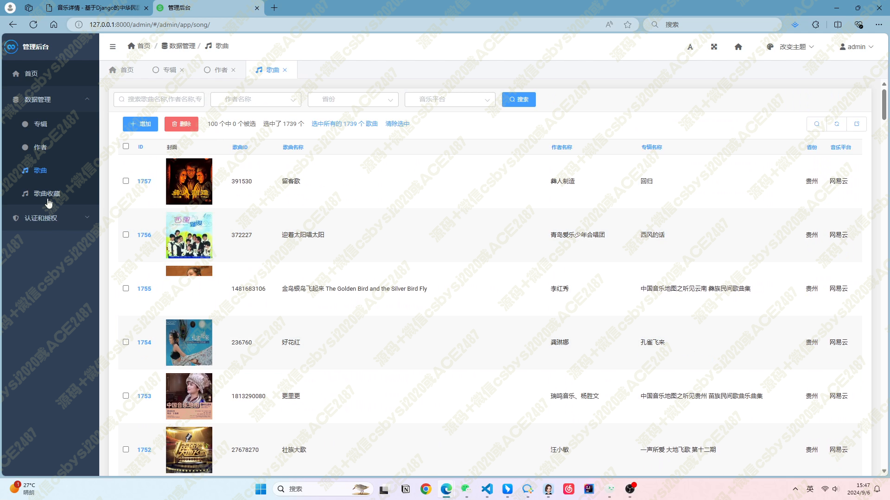
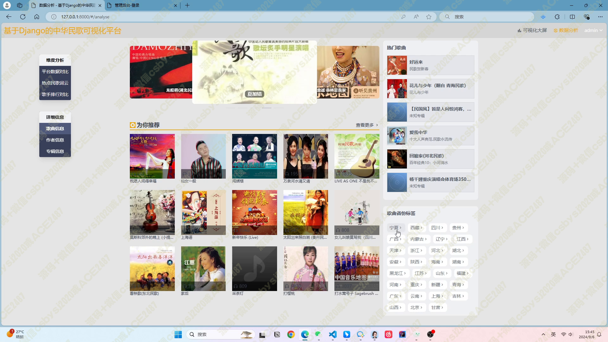
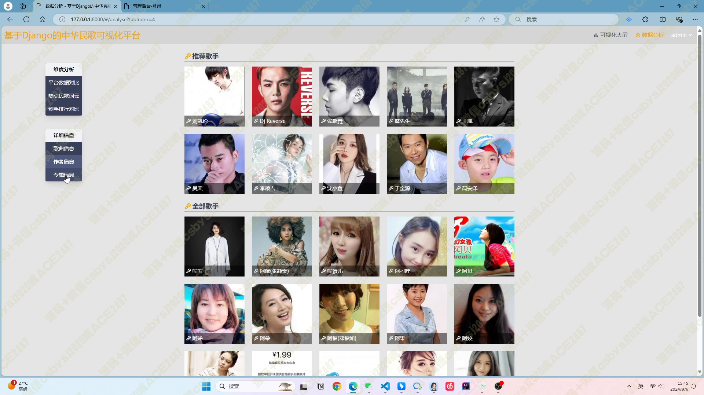
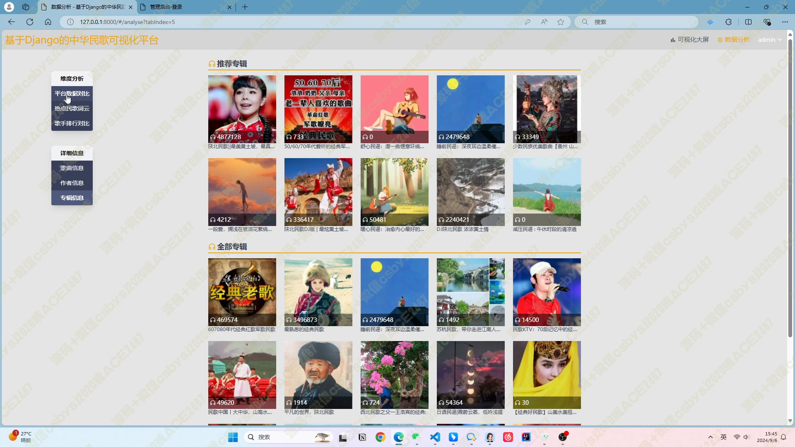
